# Hotel Room Booking
Hotel room booking project is a Full Stack website built using Django framework. This booking website is built to enable users to look for a hotel room online and make booking. Users are required to register in order to make booking. When a user registered a user profile will be generated and user can update profile biography and profile image. Users can put their reviews on the booking they made and manage their own booking details. In addition users can create, update or edit and delete their own room booking. 

[Live Project Available Here](https://roombooking-9c7bc437dd80.herokuapp.com/)

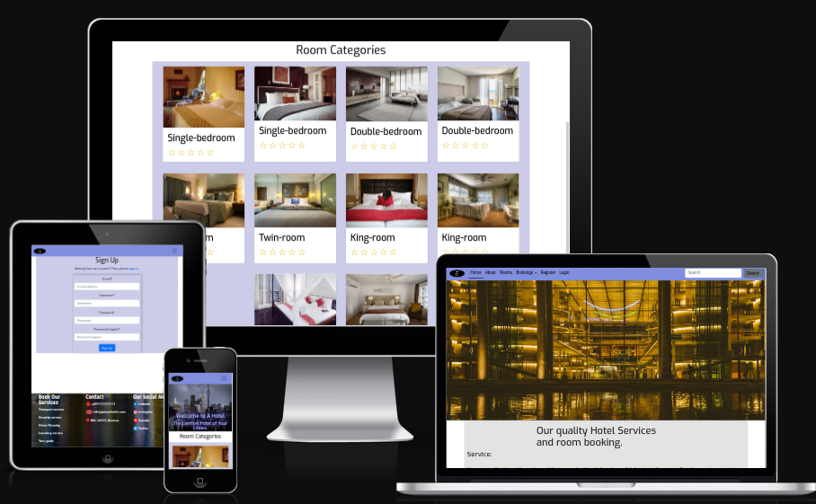

## Table of Contents

- [Hotel Room Booking](#hotel-room-booking)
  - [Table of Content](#table-of-contents)
- [User Experience - Design](#user-experience---design)
  - [Agile Methodology Plane](#agile-methodology-plane)
    - [The Main-Goal](#the-main-goal)
    - [Agile Methodology](#agile-methodology)
      - [Epics](#epics)
      - [User Stories](#user-stories)
  - [Website-Scope-Plane](#website-scope-plane)

  

# User Experience - Design 

## Agile Methodology Plane

### The Main-Goal

The main goal of this website is to develop hotel management system that can provide booking services online for users and help hotel staff member to monitor room bookings and make the necessary preparation.

The site provides customers with all the neccessary information on room services and room detail views so that customers can plan for their booking before their arrival to the hotel without facing any problems. 

### Agile Methodology

Agile methodologies are the building block of this project. Each block feature is delivered within a sprint. There are 8 sprints in this project. 

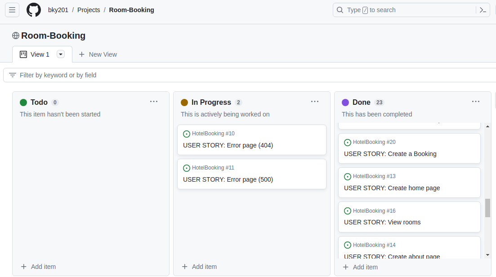

#### Epics

The project had 8 main Epics (milestones):

**EPIC 1 - Project Setup**

Setting project environment is a self-contained workspace that isolates Python packages and dependencies for a specific project, preventing conflicts with other projects. It allows developers to manage project-specific libraries and versions, ensuring consistency and reproducibility. In the next step, setting the navigation bar, is a crucial element found at the top of webpages, offering users quick access to important sections or pages. Conversely, the footer, situated at the bottom of the page, supplies additional information like contact details, copyrights, and useful links, enriching the overall user experience. Alongside these, creating static files such as images, and stylesheets, were added for enhancing a website's design and interactivity by providing the necessary visual and interactive elements. These elements collectively ensure a well-structured, informative, and engaging web presence. 

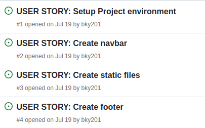

**EPIC 2 - Setup base template, deployment and Allauth Authentication**

This epic include base setup and an early stage app deployment to heroku so that the site is easily accessible online. The base setup is a foundational HTML document that serves as a starting point for creating multiple web pages within a website. It typically includes the common structural elements of a website, such as the header, navigation bar, footer, and placeholders for content. Authentication was included in this epic to process and verify the identity of a user, device, or system attempting to access a resource or service on the website. It ensures that the entity requesting access is who or what it claims to be. Authentication is a fundamental component of security and is used to protect our site from unautherized user to gain access to secure accounts, and ensure that only authorized entities can access protected resources.

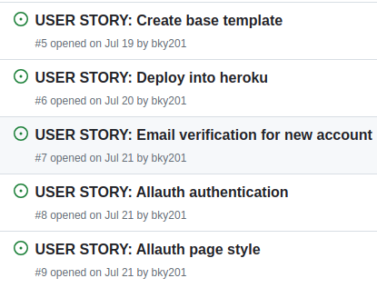

**EPIC 3 - Error alerts, home and about page**

This epic is about customizing error pages, especially the 404 and 403 pages, inorder to get best practice in the website development. It not only enhances the user experience by providing helpful information but also ensures that the design and branding of our website are consistent even when errors occur. Additionally, for the 500 error, administrators should be alerted to investigate and resolve the underlying server issue promptly. A home page and an about page are fundamental components of a website, each serving a distinct purpose. The home page is the main landing page of our website, typically accessible via the root domain. The about page includes the website's mission, history, and contact information. The home page serves as the front door of our website, offering a snapshot of its content and enticing visitors to explore further, while the about page provides context and background information, fostering trust and connection with the audience. Both pages are essential for a well-rounded and user-friendly web presence.

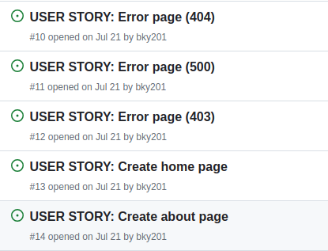

**EPIC 4 - Room list**

The room list epic is for all stories that relate to the creating, deleting, editing and viewing of room list and details. This allows for regular users to view room list and room detail and for staff members to manage them with a admin panel.

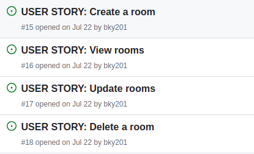

**EPIC 5 - Search box**

The search box epic is for helping using to search for the rooms based on different options. This allows users to easily view rooms based on the category they want, booking easily.

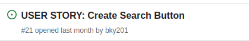

**EPIC 6 - Booking Epic**

The booking epic is for all stories that relate to creating, viewing, updating and deleting bookings. This allows the staff to easily view upcoming bookings, manage the bookings and also for customers to book and manage their own booking.

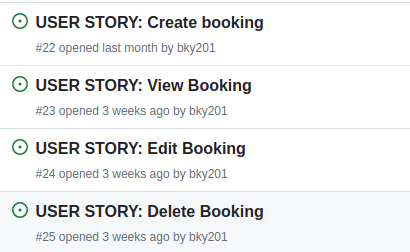

**EPIC 7 - User Profile and Review**

This epic is for s user profile which is a dedicated page within our website that displays information about a user.It typically includes details such as the user's name, profile picture, contact information, and any additional personal or demographic data. A review is an evaluation or assessment of a booking, service, or experience submitted by a user or customer. Reviews include a written description of the user's experience, along with a rating  scale (stars points).

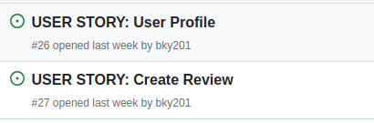

**EPIC 8 - Documentation**

This epic is for written materials and resources created during the software development process to plan, design, build, test, deploy, and maintain our software application.The documentation contributes to better project organization, easier maintenance and troubleshooting, and improved user experiences. It also aids in maintaining written or electronic materials that provide information about our project. Documentation serves various purposes, including communication, education, reference, and compliance. 

#### User Stories

The following user stories (by epic) were completed over the 3 sprints:

**EPIC 1 - Project Setup**

As a developer I need to set up the project so that I can execute it on separate working environment

As a developer I can create the navbar so that user can navigate between pages

As a developer I can create the footer so that social media links and contact information accessed

**EPIC 2 - Setup base template, deployment and Allauth Authentication**

As a developer I can create the base page and structure so that pages can use the main structure

As a developer I can deploy the website into heroku so that it is available online to users

As a Site provider I can request users email verification after new account registration so that make sure the email is valid

As a developer I can use allauth so that users sign up and access the website

As a developer I can style allauth pages so that Pages get proper structure

**EPIC 3 - Error alerts, home and about page**

As a developer I can create 404 error page so that users know the page doesn't exist

As a developer I can create error page 500 so that users know it is internal server error

As a developer I can create a home page so that users can start access website features

As a developer I can create an about page so that users can get information about the website

**EPIC 4 - Room list**

As a staff user I can create a new room so that customers can make booking

As a staff user I can view booking list so that I can manage room booking services

As a staff user I can edit booking list so that updates are added to booking list

As a staff user I can delete a room from booking list so that it is no longer in use

**EPIC 5 - Search box**

As a developer I can create a search Box on home page so that users can search for a room features

**EPIC 6 - Booking**

As a user I can make booking so that I can visit the hotel room.

As a user I can view my bookings so that I can check my information

As a user I can edit a booking so that I can make changes

As a user I can delete a booking so that I no longer use it

**EPIC 7 - User Profile and Review**

As a user I can create a profile so that I can register my details and upload a profile image

As a user I can put a review and comments so that I can express my opinion

**EPIC 8 - Documentation**

Tasks:

* Prepare readme documentation
* Prepare testing documentation write up

## Website-Scope-Plane

* Users can easily understand how to interact with the website without extensive instructions or prior knowledge.
* Information and instructions are presented in a clear and straightforward manner, minimizing confusion.
* Efficient in achieving the intended tasks, reducing the time and effort required from the user.
* Consistent design elements, such as button placements, fonts, and color schemes, help users navigate and interact with the website more comfortably.
* Error messages and guidance when users make mistakes, helping them get alerted easily.
* Provide feedback to users about their actions, whether it's confirming a successful operation or notifying of an error.
* Offer customization options or CRUD options, allowing users to adapt the booking to their preferences or needs.
* Ability to perform CRUD functionality on Menus and Bookings
* conduct user testing to gather feedback from real users and make improvements based on their experiences.
* Minimal Learning Curve: the website require little to no learning curve, enabling users to start using it effectively right away.

## Website-Structure-Design

### Features

**Navigation Menu**

 The Navigation menu is made up of the follow tabs:Home, About, Rooms, Bookings, Profile, Reviews, Register and Login tabs.

 The navigation menu serves as a navigational tool that allows users to access different sections, pages, or features of the website. Here are some key points about navigation menus:

  * Home - Visible to all
  * About - Visible to all
  * Rooms - Visible to all
    * Manage Bookings - accessible by logged in users
    * Create Booking - accessible by logged in users
  * Booking (Drop Down):
    * Manage Bookings - accessible by logged in users
    * Create Booking - accessible by logged in users
  * Login - Visible to logged out users
  * Register - Visible to logged out users
  * Logout - Visible to logged in users

The navigation menu is displayed on all pages and they adapt to different screen sizes and devices. This will provide users with a structured and organized way to move around a website. It helps users find and access the content or functionality they are looking for.

**Home Page**

The home page contains a sliding images of different views and provides an introduction to the website, offering a brief overview of its purpose, content, or services.

The home page highlights key content or features that our website offers. This include a brief summary about services and booking information deemed important for users to see.

The last section of the home page contains a sample of rooms to enable visitors get their first impression of our website and guiding them to explore further.

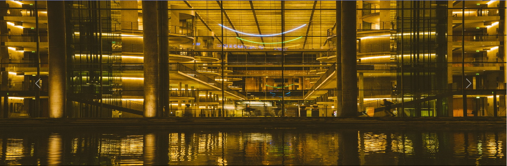

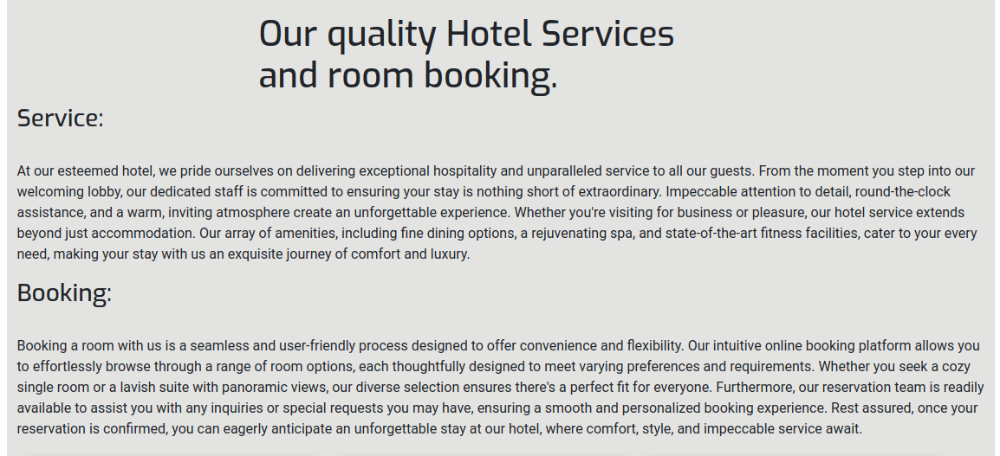

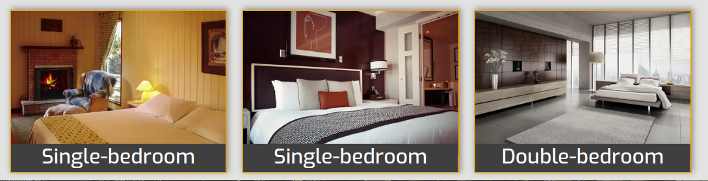

**Footer**

We've introduced a footer at the bottom of the site, featuring convenient links to our Twitter and Facebook profiles. This allows users to easily follow our Hotel Services on social media and stay updated with our website. To ensure accessibility, we've included descriptive aria-labels for these icons, making it clear to users employing assistive screen reading technology what the links are for. Additionally, to avoid disrupting the user experience, these links open in new tabs when clicked, preserving the continuity of their site visit.

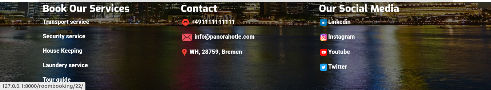

About Page:

This page includes details about the mission, team, and an overview of the entity, including its name, mission statement, and core values. This section include photos, names, roles, backgrounds and marking the location of the hotel to allow the user to locate the hotel very easily.

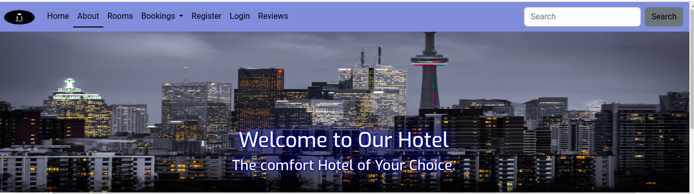

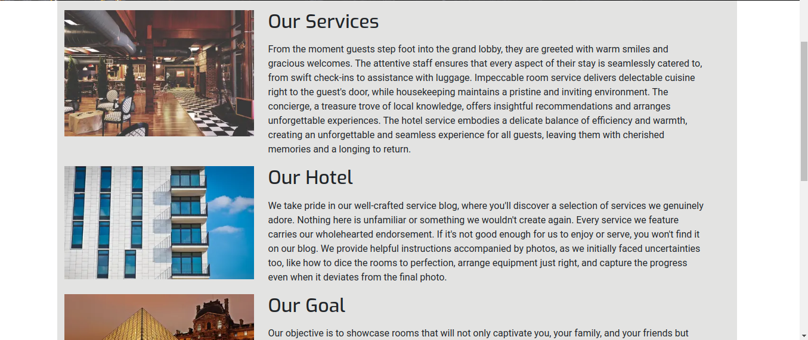

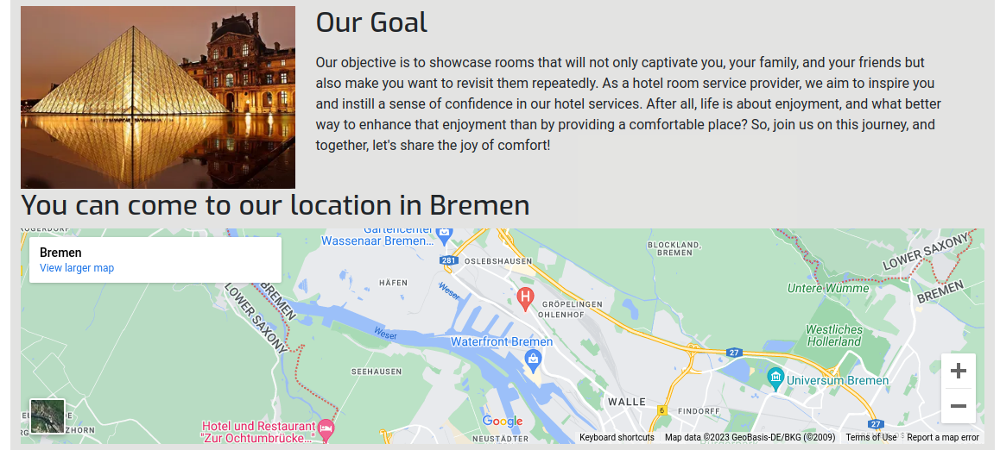

**Room List Page**

A room list page was designed to enable hotel staff employees to add rooms in the room list via the admin panel. This will allow hotel admin to update rooms if they have any changes to the room booking list.

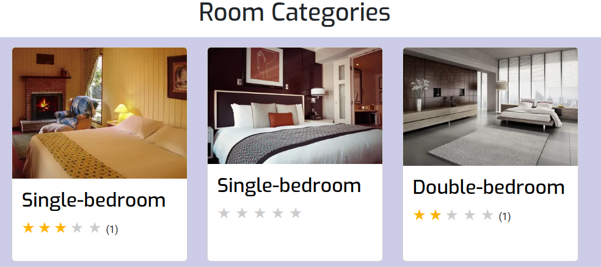

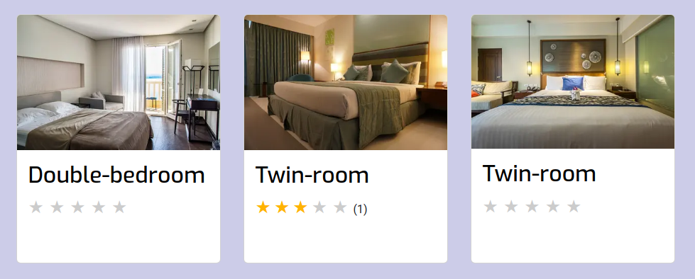

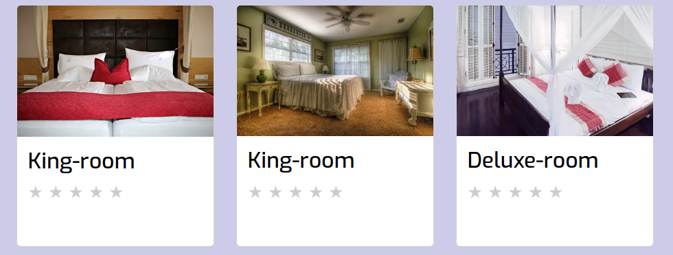

**View Room Detail Page**

A room detail page has been designed to allow users to see the current room views and services available and decide whether they are interested in the room price before booking. This information is available to everyone, login is not required.This approach prioritizes user-friendliness and ensures that core information is readily available to everyone.

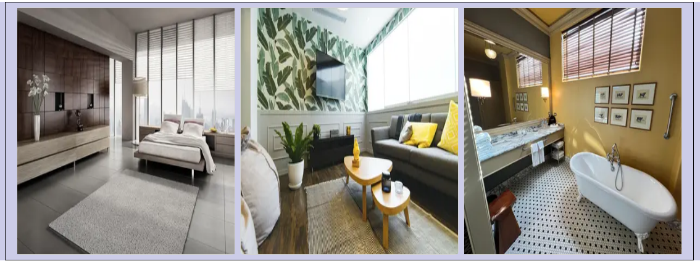

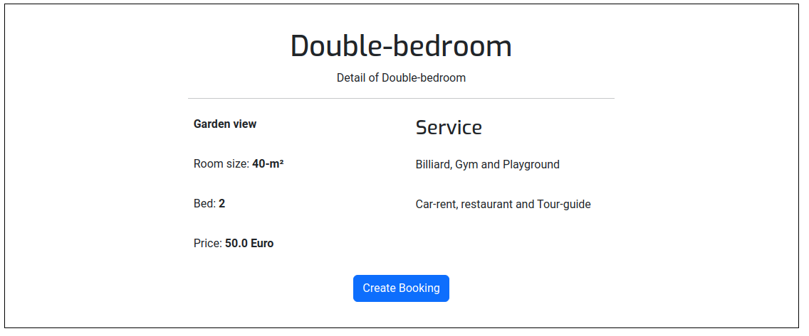

**Create booking page**

A booking page for users was designed with a form that enables the user to enter details for booking enables the user to easily make a booking through the UI. 

Some booking validation criteria was applied to the form to ensure that there there is no overlapping booking made by different users on the same room. If the room is booked by other customer the form alerts the user that booking is not available on the given date. 

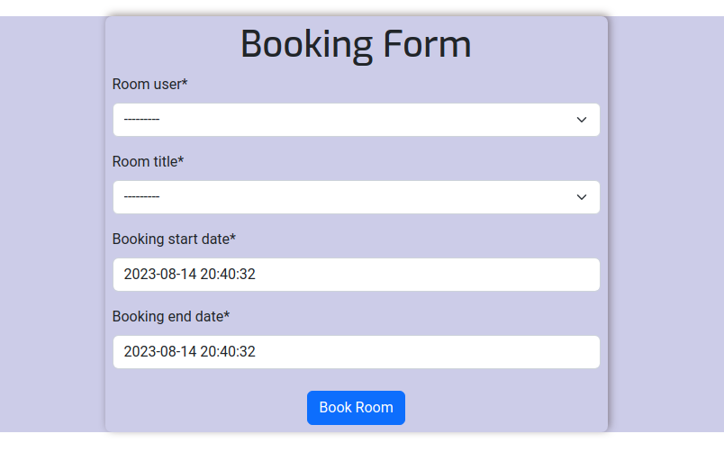

**Manage bookings page**

A manage bookings page was add in order for user to have access of bookings made previously. Login validation is required for the user in order to have access on their own bookings. If the user is validated then the user will be redirected to the bookings list to view their scheduled bookings.

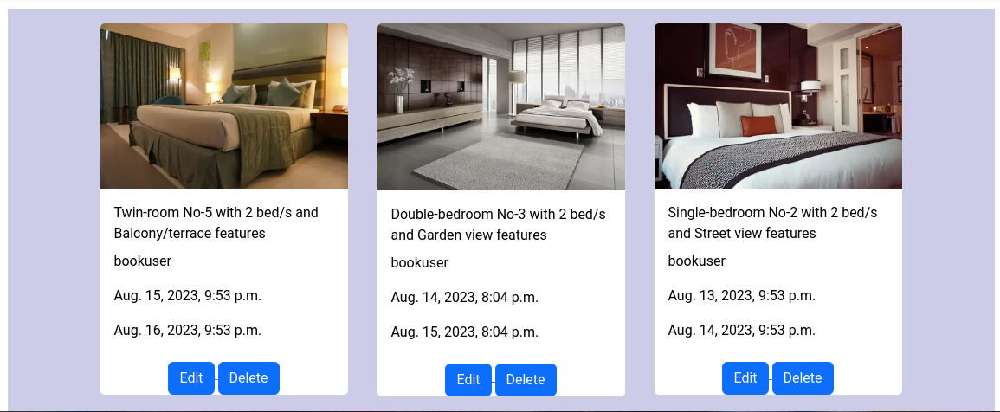

**Edit Booking Page**

On the 'Manage Bookings' page, you'll find an 'Edit' button that directs users to a form, enabling them to update their booking as needed. This convenient feature empowers users to effortlessly oversee and modify their own reservations.

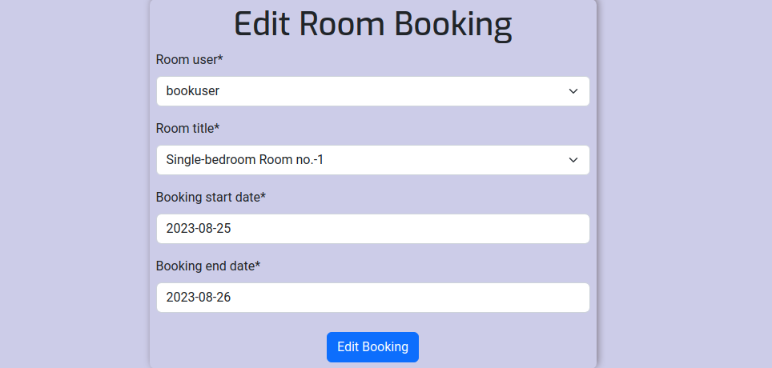

**Success Message**

Custom messages were added to confirm a successful creation or editing of bookings. This will provide notification to the user that the booking was successfully created or edited.

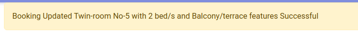

**Search box**

A "search box" is a graphical user interface (GUI) element was implemented to allow users to input specific keywords, phrases, or queries to search for rooms within the hotel. Search box facilitates information retrieval and navigation within the website, making it easier for users to find what they're looking for quickly and efficiently.

**Delete Booking**

A delete button was added to the manage bookings page that will enable users to delete their booking. 

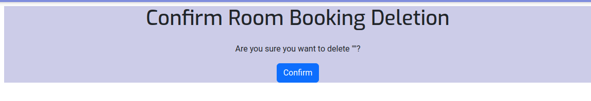

**Favicon**

A "favicon" a small, iconic image that represents a website, was created to feature a simplified version of a website's distinctive symbol or brand. This helps users recognize the site quickly when multiple tabs or bookmarks are open in their browser. 
    

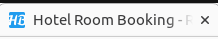

**Error Pages**

**404 Page**

a "404 Error Page" or simply an "Error 404 Page," is displayed to a user when they try to access a URL (Uniform Resource Locator) on a website, but the server cannot find the requested page. The "404" status code is part of the HTTP protocol, indicating that the requested resource (web page) does not exist.

The custom 404 page will allow the user to easily navigate back to the main page if they direct to a broken link / missing page, with custom link that directs the user to home page. 

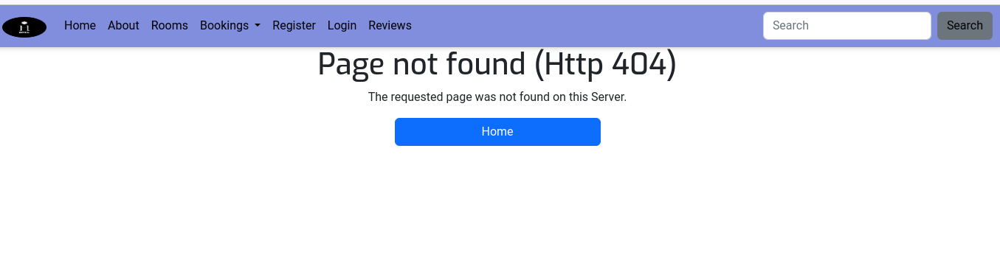

**500 Page**

A 500 error page has been displayed to alert users when an internal server error occurs. The message relays to users that the problem is on our end, not theirs.

### Features Left To Implement
- In a future release I would like to add a page which enable staff members to perform CRUD for room booking from UI without using the admin panel. 

## The-Skeleton-Plane

### Wireframes

- Home page

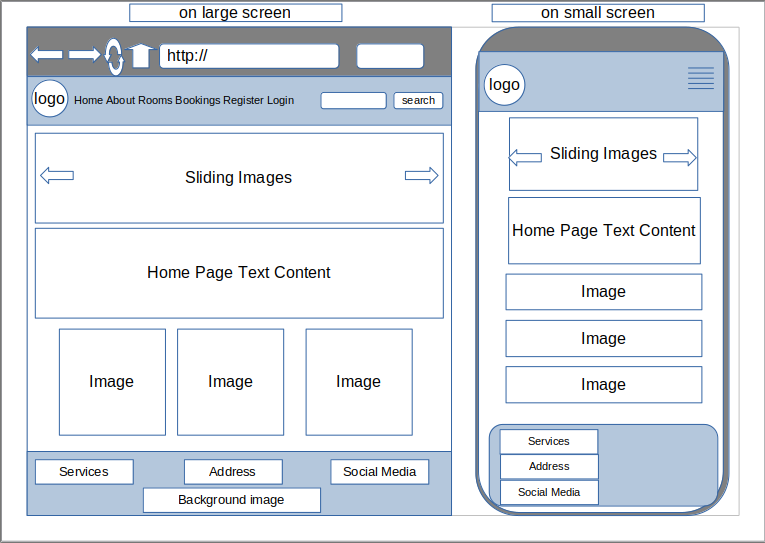

- Signup page

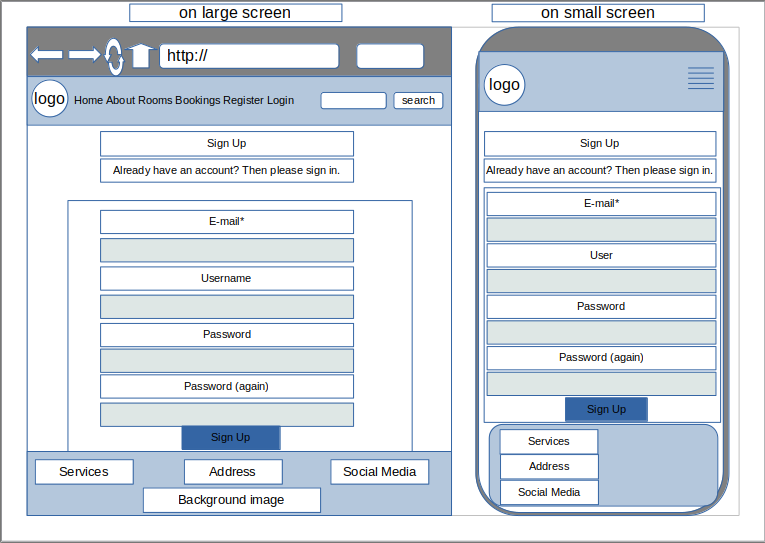

- Log in

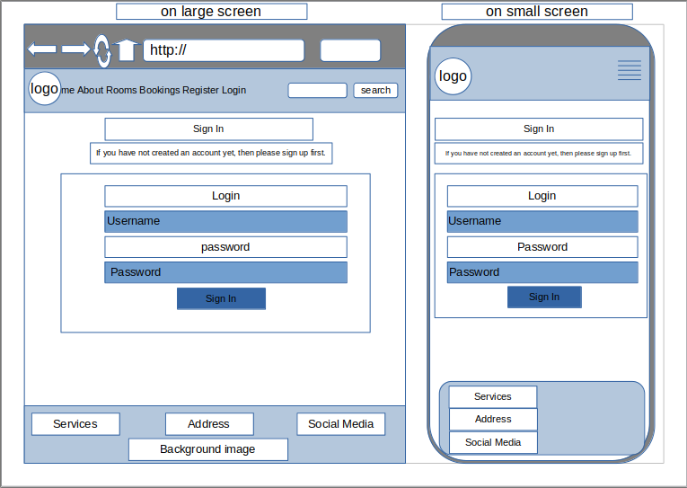

- Log Out

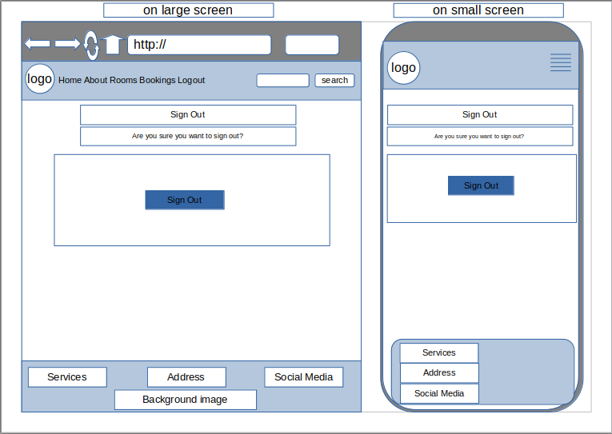

- Create Booking

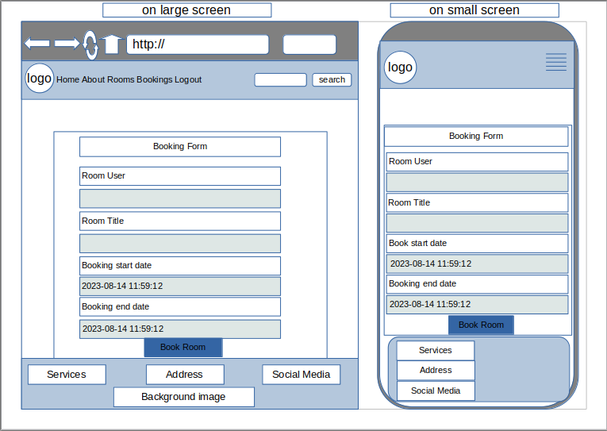

- Edit Booking 

- Manage Bookings

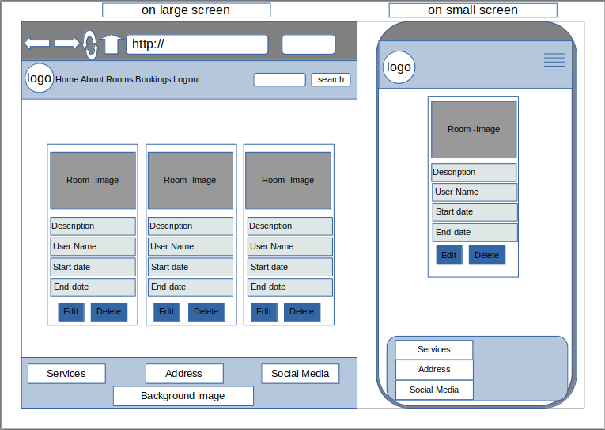

- Delete Booking 

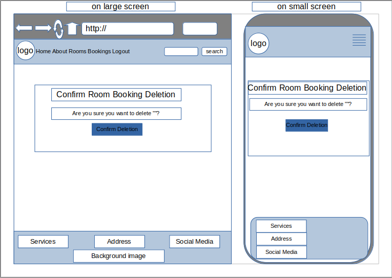

- 404 Error 

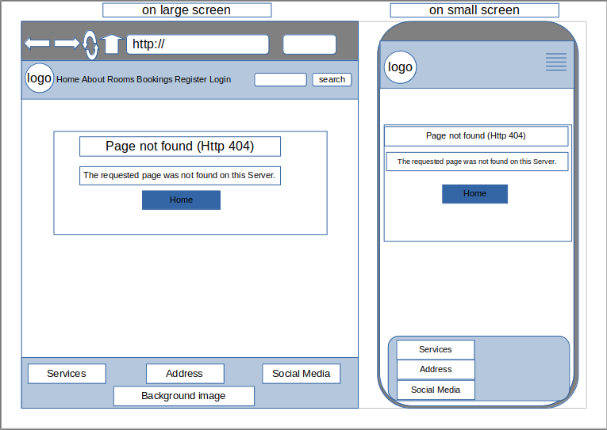

- 500 Error 

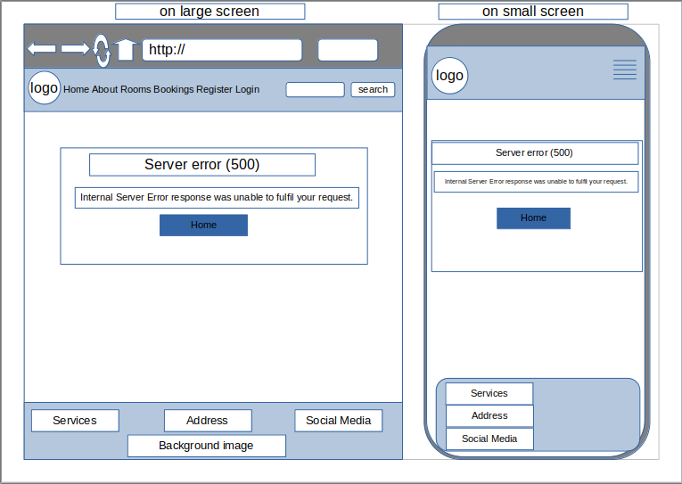

### Database-Design

The application's database is composed of several distinct tables, each serving a specific purpose. These tables include Room, Booking, Category, User, Review, Profile, and Auth-User. Together, they empower users to seamlessly carry out CRUD (Create, Read, Update, Delete) operations through an intuitive web-based user interface.

Of these tables, the User database takes center stage, serving as the primary table within the application. It establishes vital connections with other tables through foreign key relationships, enhancing the overall functionality and cohesion of the system.

Within the database, bookings are intricately linked to customers (users) through a Foreign Key relationship. This connection empowers users with the capability to seamlessly access, view, and update bookings associated with their individual accounts.

This functionality not only enhances user experience but also ensures that customers have full control and visibility over their reservations. It provides a convenient means to make changes, check booking details, and manage their bookings efficiently, contributing to a user-centric approach within the application.

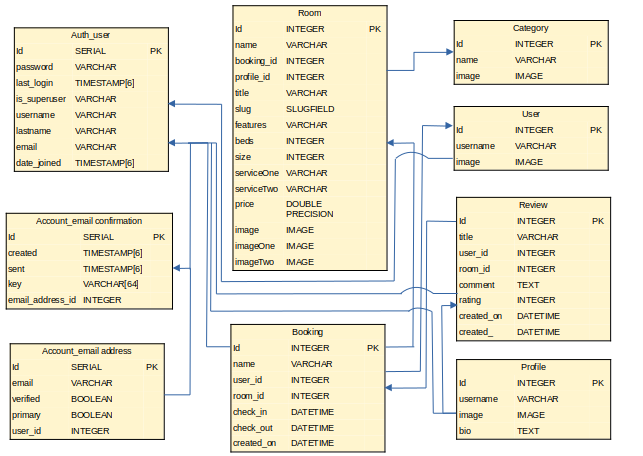

### Security

Views were secured by using the django class based view mixin, UserPassesTextMixin. A test function was created to use the mixin and checks were ran to ensure that the user who is trying to access the page is authorized. Any staff restricted functionality, user edit/delete functionality listed in the features was secured using this method.

Environment variables were stored in an env.py for local development for security purposes to ensure no secret keys, api keys or sensitive information was added the the repository. In production, these variables were added to the heroku config vars within the project.

## Design

### Colour-Options

The primary color scheme of the website is centered around a sleek and modern design. It features a classic combination of deep black (#000000) as the foundational text color, which provides a timeless backdrop. Crisp white (#FFF) font color ensures excellent readability and contrast.

To add depth and visual interest, subtle touches of pale blue (#e0e0dee0) have been introduced to various backgrounds, creating an understated elegance throughout the site. This soft blue hue serves to enhance the overall aesthetic appeal.

For interactive elements and key call-to-action items, a vibrant shade of blue takes the spotlight. This primary blue color is employed for buttons, drawing users' attention to important actions, and it also graces the website's navbar, ensuring consistency and easy navigation.

### Typography

Consistency in typography enhances the website's overall aesthetic and readability. To achieve this, the website employs the modern and versatile Roboto font for the body text, ensuring a clean and legible reading experience for users.

For titles and headings, the elegant Exo font, sourced from Google Fonts, is employed. This distinctive typeface adds a touch of sophistication and visual impact to key elements across the website.

Both the Roboto and Exo fonts have been thoughtfully imported into the website's stylesheet, ensuring seamless integration and consistent typography throughout the platform. This attention to font selection contributes to the site's cohesive and polished design, enhancing the overall user experience.

### Imagery

The website's logo was created using a FREE LOGO online tool, thoughtfully incorporating the color black to establish a distinct and memorable visual element within the website's overall color scheme. This strategic use of black not only reinforces the design's consistency but also contributes to the logo's ability to stand out as a recognizable symbol representing the website's identity. 

The website's images were sourced from Pexels and Unsplash, both reputable platforms offering a wide selection of royalty-free images. This choice ensures that the visuals used on the website not only enhance its aesthetic appeal but also adhere to legal and ethical standards regarding image usage.

## Technolgies

* Python 
  * Python is the programming language applied to design this application.
* JavaScript
  * JavaScript was utilized to create a custom modal on the profile page, to integrate the Bootstrap, further enriching the website's interactivity.
* Visual Studio Code
  * Visual Studio Code IDE tool was utilized in building the website. 
* HTML
  * The primary language utilized in constructing the Website's structure was HTML.
* CSS
  * The styling of the Website was designed by utilizing an separate CSS file.
* Git
  * The source code of the Website was regularly committed and pushed during its development using Git.  
* GitHub
  * The source code of the website is accessible on GitHub, and it has been uploaded using Git Pages.  
* Favicon.io
  * The favicon files were generated using https://favicon.io/favicon-converter/.  
* Font Awesome
  * The social media links in the footer section were adorned with icons obtained from https://fontawesome.com/.  
* Tinyjpg
  * To reduce the size of the images used throughout the website, https://tinyjpg.com/ was employed as main tool.

**Python Modules**

* Django Class-Based Views (ListView, UpdateView, DeleteView, CreateView): These classes were utilized to streamline the creation, reading, updating, and deletion of content in the application, simplifying the view logic and promoting code reusability.

* Mixins (LoginRequiredMixin, UserPassesTestMixin): Mixins such as LoginRequiredMixin and UserPassesTestMixin were employed to enforce essential features like requiring user authentication before accessing specific views and verifying whether a user is authorized to perform certain actions within the application.

* Messages: The 'messages' framework in Django was harnessed to provide informative and user-friendly feedback to site visitors. It facilitated the display of toasts and notifications to communicate actions' outcomes effectively.

## Testing

## Deployment

### Repository

The website was developed using the Visual Studio code editor and uploaded to the remote repository named 'HotelBooking' on GitHub.

During the development process, the following Git commands were utilized to push the code to the remote repository:

1. `git add [file]` command was utilized to include the file(s) in the staging area prior to committing them.
2. `git commit -m [commit message]` command was employed to record and save the changes made to the local repository, preparing them for the final step.
3. `git push` command was utilized to upload all committed code to the remote repository on GitHub.

### Hosting on Heroku

* The website was successfully published on Heroku applications. The deployment process involved the following steps:
  * Open Heroku website and click "New" to create a new app.
  * Create an app name and region region, click "Create app".
  * Click "Settings" and click Config Vars. Add the following config variables:
    * KEY: PORT
    * VALUE: 8000
  * Select Buildpacks and add buildpacks for Python and NodeJS (in that order).
  * Click to "Deploy". Select the deployment type to Github and enter repository name and connect.
  * At the bottom of the page go to Manual Deploy, select "main" branch and select "Deploy Branch".
  * Once completed successfully, after waiting for some time the app will be deployed to heroku. 
  
## Clone the repository code locally

To create a local copy of the repository code by cloning it just do the following steos:

  * Navigate to the GitHub Repository that you want to clone locally, and then click on the dropdown button labeled "Code".
  * Click on "HTTPS" and copy the link.
  * Open your IDE and install git.
  * On your cmd line write git clone "your https link".
