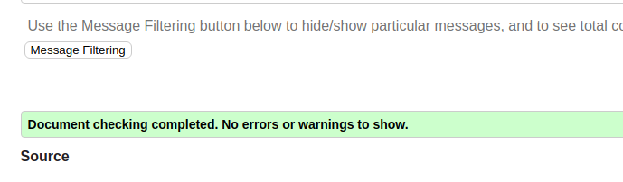
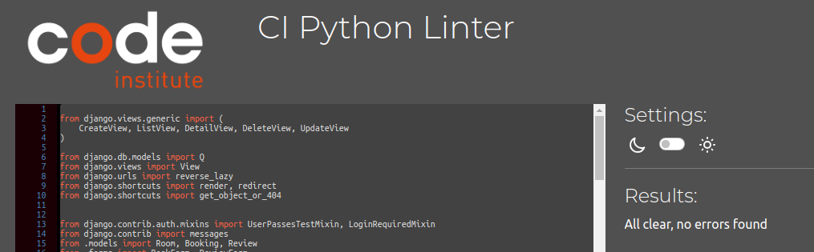
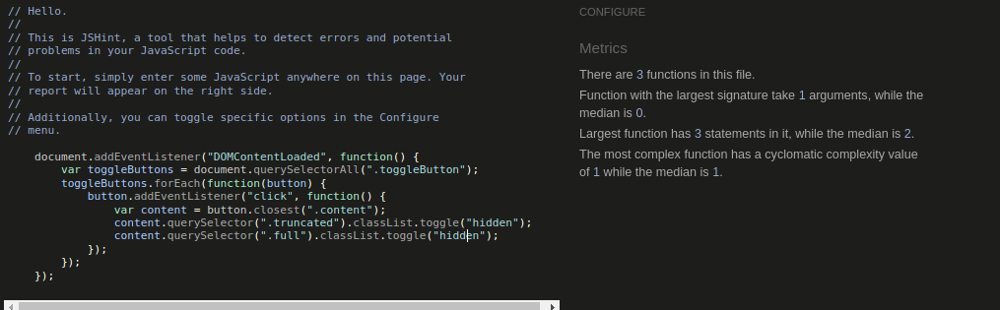
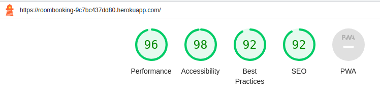

## Functional Testing

**Authentication**

Description:

Ensure a user can sign up to the website

Steps:

1. Navigate to [Hotel-Room-Booking](https://roombooking-9c7bc437dd80.herokuapp.com) and click Register
2. Enter email, username and password 
3. Click Sign up

Expected:

An email is recieved with a link to sign up, upon clicking the link, registration is successful

Actual: 

An email is recieved with a link to sign up, upon clicking the link, registration is successful

Description:

Ensure a user can log in once signed up

Steps:
1. Navigate to [Hotel-Room-Booking](https://roombooking-9c7bc437dd80.herokuapp.com)
2. Enter login details created in previous test case
3. Click login

Expected:

User is successfully logged in and redirected to the home page

Actual:

User is successfully logged in and redirected to the home page

Description:

Ensure a user can sign out

Steps:

1. Login to the website
2. Click the logout button
3. Click confirm on the confirm logout page

Expected:

User is logged out

Actual:

User is logged out

**Booking Forms**

Description:

Ensure a new booking can be created.

Steps:

1. Navigate to [Hotel-Room-Booking](https://roombooking-9c7bc437dd80.herokuapp.com) - Login if prompted.
2. Enter the following:
    - Room user: bookuser
    - Room title: Single-bedroom Room no.-1
    - Booking start date: Any future date
    - Booking end date: Any future date after start date
3. Click Create

Expected:

Form successfully submits and a toast is shown to alert the user of successful booking.

Actual:

Form successfully submits and a toast is shown to alert the user of successful booking.

 

Description:

Ensure a booking can be edited.

Steps:

1. Navigate to [page](https://sizzle-and-steak.herokuapp.com/booking/managebookings/) - Login if prompted.
2. Enter the following:
    - Room user: bookuser
    - Room title: Single-bedroom Room no.-1
    - Booking start date: Any future date
    - Booking end date: Any future date after start date
3. Click Edit

Expected:

Form successfully submits and a toast is shown to alert the user of updated booking.

Actual:

Form successfully submits and a toast is shown to alert the user of updated booking.

Description:

Ensure user can successfully delete a booking.

Steps:
1. Login as a user with a booking or create a new booking
2. Click the Manage Booking nav link
3. Click the delete button on a booking
4. Click the confirm button on the delete page

Expected:

Booking is successfully deleted

Actual:

Booking is successfully deleted

**Rooms Pages**

Description:

Ensure a new Room can be created

Steps:

1. Sign in as an admin user
2. Select the Create rooms item in the room nav bar
3. Enter the follow details:
    -title = Single-bedroom
    -number = 10
    -features = Balcony/terrace'
    -beds = 1
    -size = 30
    -serviceOne = Laundry and Dry-cleaner
    -serviceTwo = Laundry and Dry-cleaner'
    -price = 40
    -image = image-A
    -imageOne = image-1
    -imageTwo = image-2
4. Click Create

Expected:

New menu is created and can be viewed on the View Menus page

Actual:

New menu is created and can be viewed on the View Menus page

**Navigation Links**

Testing was performed to ensure all navigation links on the respective pages, navigated to the correct pages as per design. This was done by clicking on the navigation links on each page.

- Home -> index.html
- About -> about.html
- Rooms -> room_list.html
- Bookings Drop Down, Manage Bookings -> room_booking.html
- Bookings Drop Down, New Booking -> booking_form.html
- Profile -> profile.html
- Logout -> Sign out all auth page
- Login -> Sign in all auth page
- Register -> Sign up all auth page
- Reviews -> room_reviews.html

All navigation links directed to the corect pages as expected.

**Footer**

Testing was performed on the footer links by clicking the font awesome icons and ensuring that the facebook, twitter, linkedin and youtube icon opened in a new tab. These behaved as expected.

## Negative Testing

Tests were performed on the create booking to ensure that:

1. A customer cannot book a date in the past
2. A customer cannot book if booking are available for the check in and check out dates
3. Forms cannot be submitted when required fields are empty

## Unit Testing

Unit tests were created to test some basic functionality such as templates used and redirects. These can be found in the tests.py files in the respective apps.

Results:

## Accessibility

The [Wave Accessibility](https://wave.webaim.org/) tool played a pivotal role in our development journey, serving as a constant companion from the initial stages right through to the culmination of our project. During the development process, we diligently used this tool to assess and address any accessibility issues that arose.

As we approached the final testing phase, the Wave Accessibility tool continued to be a valuable asset. It provided us with a comprehensive evaluation of the live website, ensuring that it met the highest standards of accessibility. This meticulous testing was crucial to ensure that all users, regardless of their abilities or the devices they use, could access and navigate our website with ease.

Testing was conducted with a specific focus on ensuring that the following criteria were satisfactorily met:

1. **Form Accessibility:** All forms were verified to have associated labels or `aria-labels` to ensure that screen readers read out these labels to users who navigate using keyboard inputs.

2. **Color Contrast:** We meticulously checked that the color contrasts across the website adhered to the minimum ratio as specified in the WCAG 2.1 Contrast Guidelines, ensuring content is easily readable.

3. **Heading Structure:** We ensured that the heading levels followed a logical and sequential order, ensuring that the importance of content was correctly conveyed to all users.

4. **Landmarks:** To enhance usability for assistive technology users, we confirmed that all content was appropriately contained within landmarks, allowing users to efficiently navigate by page regions.

5. **Alternative Text:** Every non-textual content element, such as images and multimedia, was meticulously inspected to confirm the presence of alternative text or titles. This ensures that screen readers can provide descriptions for these elements.

6. **HTML Language Attribute:** We verified that the HTML `lang` attribute was correctly set to define the language of the page, aiding screen readers in language-specific pronunciation and processing.

7. **Aria Properties:** A thorough assessment was conducted to ensure that ARIA (Accessible Rich Internet Applications) properties were implemented correctly, enhancing accessibility for interactive elements.

8. **Best Practices:** We followed the [WCAG 2.1 coding best practices](https://www.w3.org/WAI/WCAG21/Understanding/contrast-minimum.html) throughout the testing process, ensuring that the website met the highest accessibility standards.

## Validator Testing

In pursuit of delivering a polished and technically sound website, every page underwent a rigorous validation process using the [W3C HTML Validator](https://validator.w3.org/). During this meticulous assessment, a few discrepancies were uncovered, including the presence of stray script tags, instances of headings improperly placed within spans, and a few unclosed elements.

Recognizing the critical importance of clean and standards-compliant HTML code, the team dedicated itself to resolving these issues. Each aspect was delved into, with a methodical approach taken to correct the errors that had surfaced. This rigorous effort was undertaken to ensure that the web pages not only met but exceeded the stringent validation standards set by the W3C.

As a result of this meticulous approach, all pages successfully passed the W3C HTML Validator's scrutiny. This achievement underscores the unwavering commitment to delivering a website that adheres to best practices, ensuring optimal functionality and accessibility for all users.

The presence of Django templating language code within the HTML files prevented us from performing direct copy-and-paste validation using the standard validator. Additionally, pages requiring login or those with secured views couldn't be validated through direct URI validation.

To facilitate the validation process for these files, you can follow these steps:

1. Open the page you want to validate.
2. Right-click and select "View Page Source."
3. Copy the raw HTML code from the page source.
4. Paste this raw HTML code into the validator. This code will represent the rendered HTML, allowing for accurate validation.

In order to maintain code consistency and readability, all pages underwent rigorous validation using the official PEP 8 validator. The primary objective was to ensure adherence to PEP 8 style guidelines across every aspect of the codebase.

It is essential to acknowledge that, while most of our code successfully passed through the validators, exceptions existed. Notably, the `settings.py` file posed specific challenges. These exceptions may have arisen due to unique configuration settings or project requirements that we are actively addressing to ensure alignment with PEP 8 guidelines.

The django auto generated code for AUTH_PASSWORD_VALIDATORS were showing up as lines too long. I could not find a way to split these lines but since they were auto generated and not my own custom code, I hope this is acceptable.

The JavaScript code was checked with the [JSHINT](https://jshint.com) validator. It initially identified no issues. 

## Lighthouse Report

Lighthouse was used to test the website for auditing and improving various aspects of web performance, accessibility, best practices, and SEO. Lighthouse audits provide valuable insights, but it's important to combine them with other SEO and web development best practices for a comprehensive approach to optimizing the website's performance, accessibility, best practices, and search engine ranking. Regularly monitoring and improving the site to ensure it meets evolving standards and user expectations.

To use Lighthouse for these audits:

In Chrome DevTools: Open your website in Google Chrome, right-click, and select "Inspect." Go to the "Lighthouse" tab, select the audit categories you want to test (Performance, Accessibility, Best Practices, and SEO), and click "Generate report." Review the generated report for suggestions and areas for improvement.

Using the Lighthouse CLI: You can also use Lighthouse from the command line to automate audits and integrate them into your build process.

## Responsiveness

Responsiveness test was implemented to check the ability of the website to adapt and display content effectively on various devices and screen sizes. Users can access the website on a wide range of devices, including desktop computers, laptops, tablets, and smartphones.

The design was considered for mobile devices first and then progressively enhanced the layout and functionality for larger screens. This approach ensures that the website performs well on small screens and scales up gracefully.

1. Open browser and navigate to [Hotel-room-booking](https://roombooking-9c7bc437dd80.herokuapp.com/)

2. Open Developer Tools: Right-click on your web page and select "Inspect" or press Ctrl+Shift+I (or Cmd+Option+I on Mac) to open the Developer Tools panel.

3. Switch to Responsive Mode: In the Developer Tools panel, find the "Toggle Device Toolbar" icon (usually shaped like a small phone or tablet) or press Ctrl+Shift+M (or Cmd+Option+M on Mac) to toggle responsive mode. This mode allows you to simulate different screen sizes.

4. Decrease Width to 320px: In responsive mode, you'll typically see a dropdown menu that lets you select different device presets. Choose "Custom" or enter "320" in the width field to set the viewport width to 320 pixels.

5. Set Zoom to 50%: In responsive mode, there's often a zoom option. You can change the zoom level to 50% to simulate a scaled-down view.

6. Click and Drag to Maximum Width: Now, you can click and drag the edges of the responsive window to make it larger. This action simulates how your website responds when viewed on larger screens or when the browser window is resized.

Expected:

website effectively adjusts to screens of various sizes, ensuring that images maintain their quality without appearing distorted. There is no need for horizontal scrolling, and all page elements are neatly arranged, preventing any overlapping.

Actual:

Website behaved as expected.

## Bugs

The website implemented a logic system to secure room bookings by aligning them with the specified check-in and check-out dates. However, in cases where another user attempts to reserve the same room with identical check-in and check-out dates, signifying a potential overlap, the system should ideally alert the user that the room is already reserved by another customer. Unfortunately, this was an issue encountered with this functionality, and it has been resolved during the submission.