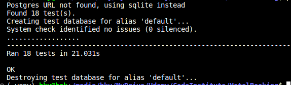

## Functional Testing

**Authentication**

Description:

Ensure a user can sign up to the website

Steps:

1. Navigate to [Hotel-Room-Booking](https://roombooking-9c7bc437dd80.herokuapp.com) and click Register
2. Enter email, username and password 
3. Click Sign up

Expected:

An email is recieved with a link to sign up, upon clicking the link, registration is successful

Actual: 

An email is recieved with a link to sign up, upon clicking the link, registration is successful

Description:

Ensure a user can log in once signed up

Steps:
1. Navigate to [Hotel-Room-Booking](https://roombooking-9c7bc437dd80.herokuapp.com)
2. Enter login details created in previous test case
3. Click login

Expected:

User is successfully logged in and redirected to the home page

Actual:

User is successfully logged in and redirected to the home page

Description:

Ensure a user can sign out

Steps:

1. Login to the website
2. Click the logout button
3. Click confirm on the confirm logout page

Expected:

User is logged out

Actual:

User is logged out

**Booking Forms**

Description:

Ensure a new booking can be created.

Steps:

1. Navigate to [Hotel-Room-Booking](https://roombooking-9c7bc437dd80.herokuapp.com) - Login if prompted.
2. Enter the following:
    - Room user: bookuser
    - Room title: Single-bedroom Room no.-1
    - Booking start date: Any future date
    - Booking end date: Any future date after start date
3. Click Create

Expected:

Form successfully submits and a toast is shown to alert the user of successful booking.

Actual:

Form successfully submits and a toast is shown to alert the user of successful booking.

 

Description:

Ensure a booking can be edited.

Steps:

1. Navigate to [page](https://sizzle-and-steak.herokuapp.com/booking/managebookings/) - Login if prompted.
2. Enter the following:
    - Room user: bookuser
    - Room title: Single-bedroom Room no.-1
    - Booking start date: Any future date
    - Booking end date: Any future date after start date
3. Click Edit

Expected:

Form successfully submits and a toast is shown to alert the user of updated booking.

Actual:

Form successfully submits and a toast is shown to alert the user of updated booking.

Description:

Ensure user can successfully delete a booking.

Steps:
1. Login as a user with a booking or create a new booking
2. Click the Manage Booking nav link
3. Click the delete button on a booking
4. Click the confirm button on the delete page

Expected:

Booking is successfully deleted

Actual:

Booking is successfully deleted

**Rooms Pages**

Description:

Ensure a new Room can be created

Steps:

1. Sign in as an admin user
2. Select the Create rooms item in the room nav bar
3. Enter the follow details:
    -title = Single-bedroom
    -number = 10
    -features = Balcony/terrace'
    -beds = 1
    -size = 30
    -serviceOne = Laundry and Dry-cleaner
    -serviceTwo = Laundry and Dry-cleaner'
    -price = 40
    -image = image-A
    -imageOne = image-1
    -imageTwo = image-2
4. Click Create

Expected:

New menu is created and can be viewed on the View Menus page

Actual:

New menu is created and can be viewed on the View Menus page

**Navigation Links**

Testing was performed to ensure all navigation links on the respective pages, navigated to the correct pages as per design. This was done by clicking on the navigation links on each page.

- Home -> index.html
- About -> about.html
- Rooms -> room_list.html
- Bookings Drop Down, Manage Bookings -> room_booking.html
- Bookings Drop Down, New Booking -> booking_form.html
- Profile -> profile.html
- Logout -> Sign out all auth page
- Login -> Sign in all auth page
- Register -> Sign up all auth page
- Reviews -> room_reviews.html

All navigation links directed to the corect pages as expected.

**Footer**

Testing was performed on the footer links by clicking the font awesome icons and ensuring that the facebook, twitter, linkedin and youtube icon opened in a new tab. These behaved as expected.

## Negative Testing

Tests were performed on the create booking to ensure that:

1. A customer cannot book a date in the past
2. A customer cannot book if booking are available for the check in and check out dates
3. Forms cannot be submitted when required fields are empty

## Unit Testing

Unit tests were created to test some basic functionality such as templates used and redirects. These can be found in the tests.py files in the respective apps.

Results:

## Accessibility

The [Wave Accessibility](https://wave.webaim.org/) tool played a pivotal role in our development journey, serving as a constant companion from the initial stages right through to the culmination of our project. During the development process, we diligently used this tool to assess and address any accessibility issues that arose.

As we approached the final testing phase, the Wave Accessibility tool continued to be a valuable asset. It provided us with a comprehensive evaluation of the live website, ensuring that it met the highest standards of accessibility. This meticulous testing was crucial to ensure that all users, regardless of their abilities or the devices they use, could access and navigate our website with ease.

Testing was conducted with a specific focus on ensuring that the following criteria were satisfactorily met:

1. **Form Accessibility:** All forms were verified to have associated labels or `aria-labels` to ensure that screen readers read out these labels to users who navigate using keyboard inputs.

2. **Color Contrast:** We meticulously checked that the color contrasts across the website adhered to the minimum ratio as specified in the WCAG 2.1 Contrast Guidelines, ensuring content is easily readable.

3. **Heading Structure:** We ensured that the heading levels followed a logical and sequential order, ensuring that the importance of content was correctly conveyed to all users.

4. **Landmarks:** To enhance usability for assistive technology users, we confirmed that all content was appropriately contained within landmarks, allowing users to efficiently navigate by page regions.

5. **Alternative Text:** Every non-textual content element, such as images and multimedia, was meticulously inspected to confirm the presence of alternative text or titles. This ensures that screen readers can provide descriptions for these elements.

6. **HTML Language Attribute:** We verified that the HTML `lang` attribute was correctly set to define the language of the page, aiding screen readers in language-specific pronunciation and processing.

7. **Aria Properties:** A thorough assessment was conducted to ensure that ARIA (Accessible Rich Internet Applications) properties were implemented correctly, enhancing accessibility for interactive elements.

8. **Best Practices:** We followed the [WCAG 2.1 coding best practices](https://www.w3.org/WAI/WCAG21/Understanding/contrast-minimum.html) throughout the testing process, ensuring that the website met the highest accessibility standards.

## Validator Testing

In pursuit of delivering a polished and technically sound website, every page underwent a rigorous validation process using the [W3C HTML Validator](https://validator.w3.org/). During this meticulous assessment, a few discrepancies were uncovered, including the presence of stray script tags, instances of headings improperly placed within spans, and a few unclosed elements.

Recognizing the critical importance of clean and standards-compliant HTML code, the team dedicated itself to resolving these issues. Each aspect was delved into, with a methodical approach taken to correct the errors that had surfaced. This rigorous effort was undertaken to ensure that the web pages not only met but exceeded the stringent validation standards set by the W3C.

As a result of this meticulous approach, all pages successfully passed the W3C HTML Validator's scrutiny. This achievement underscores the unwavering commitment to delivering a website that adheres to best practices, ensuring optimal functionality and accessibility for all users.

The presence of Django templating language code within the HTML files prevented us from performing direct copy-and-paste validation using the standard validator. Additionally, pages requiring login or those with secured views couldn't be validated through direct URI validation.

To facilitate the validation process for these files, you can follow these steps:

1. Open the page you want to validate.
2. Right-click and select "View Page Source."
3. Copy the raw HTML code from the page source.
4. Paste this raw HTML code into the validator. This code will represent the rendered HTML, allowing for accurate validation.

All pages were run through the official [Pep8](http://pep8online.com/) validator to ensure all code was pep8 compliant. Some errors were shown due to blank spacing and lines too long, 1 line instead of 2 expected. All of these errors were resolved and code passed through validators with the exception of the settings.py file.

The django auto generated code for AUTH_PASSWORD_VALIDATORS were showing up as lines too long. I could not find a way to split these lines but since they were auto generated and not my own custom code, I hope this is acceptable.

JavaScript code was run through [JSHINT](https://jshint.com) javascript validator. lIt flagged up issues with undefined variables as I jad forgotten to use the let keyword. This was fixed and the only warnings remained were that they were unused variables. The functions were called via onclick from the html elements themselves, so are in fact being used.

## Lighthouse Report

Lighthouse report showed areas for improvement on SEO and Best practices. Meta descriptions and keywords were added to boost the SEO to 100 but the best practice warnings were coming from the use of an embedded iframe's javascript. Unfortunately I did not find a way to improve this as I am not initialising the google map iframe with javascript.

## Responsiveness

All pages were tested to ensure responsiveness on screen sizes from 320px and upwards as defined in WCAG 2.1 Reflow criteria for responsive design on Chrome, Edge, Firefox and Opera browsers.

Steps to test:

- Open browser and navigate to [sizzle-and-steak](https://sizzle-and-steak.herokuapp.com/)
- Open the developer tools (right click and inspect)
- Set to responsive and decrease width to 320px
- Set the zoom to 50%
-  Click and drag the responsive window to maximum width

Expected:

Website is responsive on all screen sizes and no images are pixelated or stretched. No horizontal scroll is present. No elements overlap.

Actual:

Website behaved as expected.

Website was also opened on the following devices and no responsive issues were seen:

Oukitel C21 Pro
TCL 30 Pro
iPhone SE

## Bugs

Logic has been implemented to ensure that when a booking is created that it books the table with the capacity lowest to suit the number of guests. When a user updates a booking, this does not function correctly on the edit and will reassign the booking to another table with the next lowest capacity. It should keep the booking on the current table if it is a lower capacity but unfortunately does not work correctly and has not been resolved in time for submission.